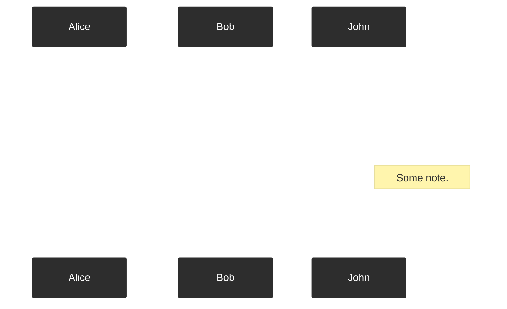

# scully-plugin-mermaid

My [Scully.io](https://scully.io) plugin [`scully-plugin-mermaid`](https://www.npmjs.com/package/@k9n/scully-plugin-mermaid) will provide a PostRenderer for [Mermaid.js](https://mermaid-js.github.io/) graphs, charts and diagrams embedded in Markdown files.

With this PostRenderer you can write Mermaid.js syntax inside code snippets in your Markdown files that will be rendered by Scully and post-rendered by Mermaid.js.
So in fact descriptions like the following in your Markdown files will be converted into SVG graphics:

<pre class="language-text"><code class="language-text">```mermaid
sequenceDiagram
    Alice ->> Bob: Hello Bob, how are you?
    Bob-->>John: How about you John?
    Bob--x Alice: I am good thanks!
    Bob-x John: I am good thanks!
    Note right of John: Some note.

    Bob-->Alice: Checking with John...
    Alice->John: Yes... John, how are you?
```</code></pre>

The above example will result in a graphic like this one:



Check out how to set it up by reading the docs in the [Github repository](https://github.com/k9n-dev/scully-plugins/tree/main/scully/plugins/scully-plugin-mermaid).

> You haven't heard about _Scully_ yet? [Check out my article series about the static site generator _Scully_](/blog/2020-01-angular-scully).
