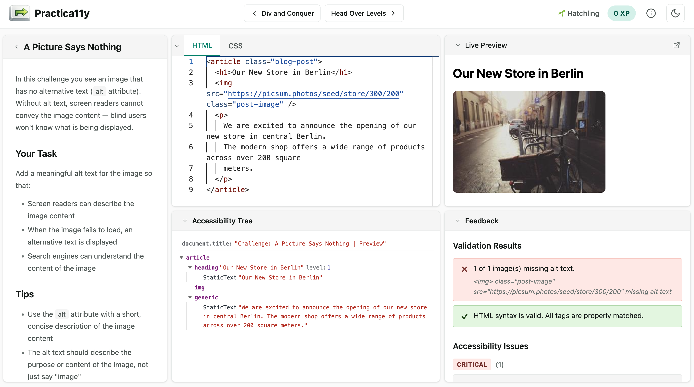

[Practica11y](https://practica11y.dev) is a gamified, browser-based learning platform for web accessibility.
Instead of just reading about accessibility, developers solve interactive challenges directly in the browser and learn the **practical** implementation of inclusive web development.

The mission is to raise awareness for web accessibility, sharpen the understanding of WCAG guidelines, and turn inclusive development into a natural habit.
Whether you are just starting out or deepening your expertise — hands-on practice makes the difference.

The platform is entirely client-side, so there is no backend required. All progress is stored locally in the browser.

## Highlights

- **Interactive challenges** solved right in the browser with a built-in Monaco editor
- **Live accessibility analysis** powered by `axe-core` and `dom-accessibility-api`
- **Accessibility tree visualization**, keyboard and focus analysis
- **Sandboxed live preview** of the user's solution
- **Gamification** with progress tracking to keep learning motivating

## Tech Stack

Built with **Angular** (Standalone Components, Signals, Zoneless Change Detection), organized as an **Nx** monorepo, styled with **Tailwind CSS**, and tested with **Vitest**.

- **[Practica11y — Website](https://practica11y.dev)**
- **[Practica11y — GitHub Repository](https://github.com/d-koppenhagen/practica11y)**
