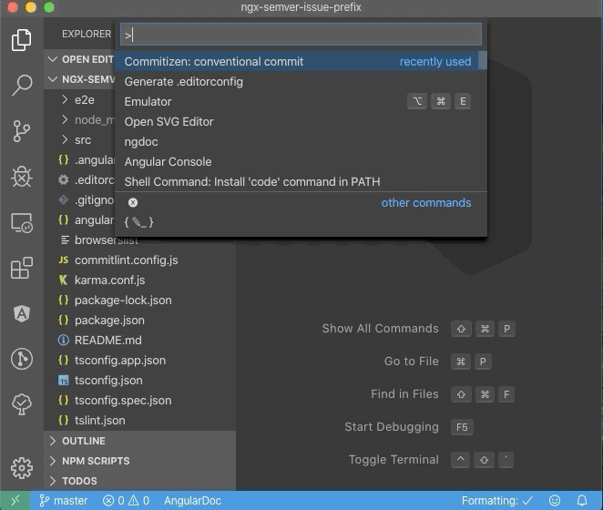

**In this article I will introduce the new tool `ngx-semantic-version`.
This new Angular Schematic allows you to set up all necessary tooling for consistent git commit messages and publishing new versions.
It will help you to keep your `CHANGELOG.md` file up to date and to release new tagged versions. All this is done by leveraging great existing tools like `commitizen`, `commitlint` and `standard-version`.**

<hr>

Table of contents:

- [TL;DR](/blog/2019-11-ngx-semantic-version#tl-dr)
- [Introduction](/blog/2019-11-ngx-semantic-version#introduction)
- [What does it do?](/blog/2019-11-ngx-semantic-version#what)
  - [commitlint: Enforcing conventional commit messages](/blog/2019-11-ngx-semantic-version#commitlint)
  - [husky: Hook into the git lifecycle](/blog/2019-11-ngx-semantic-version#husky)
  - [commitizen: Easily write conventional commit messages](/blog/2019-11-ngx-semantic-version#commitizen)
  - [standard-version: Generate changelogs from the git history](/blog/2019-11-ngx-semantic-version#standard-version)
- [How to use ngx-semantic-version](/blog/2019-11-ngx-semantic-version#how-to)
- [Conclusion](/blog/2019-11-ngx-semantic-version#conclusion)

## TL;DR

_ngx-semantic-version_ is an Angular Schematic that will add and configure _commitlint_, _commitizen_, _husky_ and _standard-version_ to enforce commit messages in the _conventional commit_ format and to automate your release and Changelog generation by respecting _semver_.
All you have to do for the setup is to execute this command in your Angular CLI project:

```bash
ng add ngx-semantic-version
```

## Introduction

Surviving in the stressful day-to-day life of a developer is not easy.
One feature follows the other, bug fixes and breaking changes come in on a regular basis.
With all the hustle and bustle, there's literally no time to write proper commit messages.

If we don't take this job serious, at the end of the day our git history will look like this:

```text
* 65f597a (HEAD -> master) adjust readme
* f874d16 forgot to bump up version
* 3fa9f1e release
* d09e4ee now it's fixed!
* 70c7a9b this should really fix the build
* 5f91dab let the build work (hopefully)
* 44c45b7 adds some file
* 7ac82d3 lots of stuff
* 1e34db6 initial commit
```

When you see such a history you know almost nothing: neither what features have been integrated nor if there was a bugfix or a breaking change. There is almost no meaningful context.

Wouldn't it be nice to have a cleaner git history that will follow a de facto standard which is commonly used?

But more than this: having a clean and well-formatted git history can help us releasing new software versions respecting semantic versioning and generating a changelog that includes all the changes we made and references to the commits.

No more struggle with forgotten version increasements in your `package.json`. No more manual changes in the `CHANGELOG.md` and missing references to necessary git commits. Wouldn't it be nice to automate the release process and generate the changelog and the package version by just checking and building it from a clean git history? And wouldn't it be nice to add all this stuff with one very simple single line command to your Angular project?

**[_ngx-semantic-version_](https://www.npmjs.com/package/ngx-semantic-version) will give you all that.**

## What does it do? <a name="what"></a>

_ngx-semantic-version_ will add and configure the following packages for you.
We will take a look at each tool in this article.

- **[commitlint](https://commitlint.js.org):** check commit messages to follow the conventional commit pattern
- **[husky](https://www.npmjs.com/package/husky):** hook into git events and run code at specific points (e.g. at commit or push)
- **[commitizen](https://www.npmjs.com/package/commitizen):** helper for writing conventional commit messages
- **[standard-version](https://www.npmjs.com/package/standard-version):** generate conventional changelogs from the git history

### commitlint: Enforcing conventional commit messages <a name="commitlint"></a>

[Commitlint](https://commitlint.js.org) will give you the ability to check your commit messages for a common pattern. A very prominent project following this pattern is the Angular repository itself. The [_conventional-commit_](https://www.conventionalcommits.org) pattern requires us to follow this simple syntax:

```text
<type>[optional scope]: <description>

[optional body]

[optional footer]
```

Let's see what is the meaning of these parameters:

- `type` can be one of the following codes:
  - `build`
  - `ci`
  - `chore`
  - `docs`
  - `feat`
  - `fix`
  - `perf`
  - `refactor`
  - `revert`
  - `style`
  - `test`
- `scope` is optional and can be used to reference a specific part of your application, e.g. `fix(dashboard): add fallback for older browsers`
- The `description` is mandatory and describes the commit in a very short form (also called `subject`)
- If necessary, a `body` and a `footer` with further information can be added which may contain:
  - The keyword `BREAKING CHANGES` followed by a description of the breaking changes
  - A reference to a GitHub issue (or any other references, such as JIRA ticket number)

An example message could look like that:

```text
refactor(footer): move footer widget into separate module

BREAKING CHANGES
The footer widget needs to be imported from `widgets/FootWidgetModule` instead of `common` now.

closes #45
```

Following this pattern allows us to extract valuable information from the git history later.
We can generate a well-formatted changelog file without any manual effort.
It can easily be determined what version part will be increased and much more.

> You may think now: "Wow, that style looks complicated and hard to remember." But don't worry: you will get used to it soon! In a second you will see how creating these messages can be simplified using _commitizen_.

If you want to try you _commitlint_ separately, you can even try it out using `npx`:


_ngx-semantic-version_ will add the configuration file `commitlint.config.js` which can be adjusted later by your personal needs.

### husky: Hook into the git lifecycle <a name="husky"></a>

[Husky](https://www.npmjs.com/package/husky) allows us to hook into the git lifecycle using Node.js.
We can use husky in combination with _commitlint_ to check a commit message right before actually commiting it.
This is what _ngx-semantic-version_ configures in our application.
It will add this part to your `package.json`:

```json
...
"husky": {
  "hooks": {
    "commit-msg": "commitlint -E HUSKY_GIT_PARAMS"
  }
},
```

Husky uses the environment variable `HUSKY_GIT_PARAMS` containing the current git message you entered and it will pass this through _commitlint_ so it can be evaluated.

Whenever you commit, _commitlint_ will now automatically check your message. 

### commitizen: Easily write conventional commit messages <a name="commitizen"></a>

Defining a well-formed message text can be quite hard when you are not used to the _conventional-changelog_ style.
The tool _commitizen_ is there to help beginners and to prevent your own negligence.
It introduces a lots of restrictions for our commit messages so that it's easier for developers to follow the pattern.
[Commitizen](https://www.npmjs.com/package/commitizen) will help you to always define a commit message in the appropriate format using an interactive CLI:


When adding _ngx-semantic-version_ it will configure _commitizen_ to use the _conventional changelog_ style as well:

```json
// package.json
...
"config": {
  "commitizen": {
    "path": "./node_modules/cz-conventional-changelog"
  }
}
```

If you are using Visual Studio Code, you can also use the extension [Visual Studio Code Commitizen Support](https://marketplace.visualstudio.com/items?itemName=KnisterPeter.vscode-commitizen) which will let you type the commit message directly in the editor:




### standard-version: Generate changelogs from the git history <a name="standard-version"></a>

[Standard-version](https://www.npmjs.com/package/standard-version) is the cherry on the cake and takes advantage of a well-formed git history.
It will extract the commit message information like `fix`, `feature` and `BREAKING CHANGES` and use this information to automatically create a `CHANGELOG.md` file.
The tool will also determine the next version number for the project, according to the [rules of semantic versioning](https://semver.org/).

_ngx-semantic-version_ will configure a new script in your `package.json` that can be used for releasing a new version:

```json
...
"scripts": {
  "release": "standard-version",
},
```

Whenever you want to release a version, you should use _standard-version_ to keep your versioning clean and the `CHANGELOG.md` up-to-date.
Furthermore, it references both commits and closed issues in your `CHANGELOG.md`, so that it's easier to understand what is part of in the release.
The tool will also tag the version in the git repo so that all versions will be available as releases via GitHub, Gitlab or whatever you are using.

## How to use _ngx-semantic-version_ <a name="how-to"></a>

Are you excited, too? Then let's get started!
Configuring all mentioned tools manually can be quite tedious.
Here is where _ngx-semantic-version_ enters the game: It is an Angular schematic that will add and configure all the tools for you.

All we need it to run the following command:

```bash
ng add ngx-semantic-version
```

After installation, your `package.json` file will be updated.
You will also find a new file `commitlint.config.js` which includes the basic rule set for conventional commits.
You can [adjust the configuration](https://commitlint.js.org/#/reference-rules) to satisfy your needs even more.

Try it out and make some changes to your project!
Commitlint will now check the commit message and tell you if it is valid or not.
It prevents you from commiting with a "bad" message.
To make things easier, _commitizen_ will support you by building the message in the right format and it even explicitly asks you for issue references and breaking changes.

If you typically use `npm version` to cut a new release, now you do this instead:

```bash
npm run release
```

You should also consider using one of the following commands:

```bash
npm run release -- --first-release  # create the initial release and create the `CHANGELOG.md`
npm run release -- --prerelease     # create a pre-release instead of a regular one
```

_standard-version_ will now do the following:

1. "Bump" the version in `package.json`
2. Update the `CHANGELOG.md` file
3. Commit the `package.json` and `CHANGELOG.md` files
4. Tag a new release in the git history

Check out the [official documentation of _standard-version_](https://www.npmjs.com/package/standard-version#release-as-a-pre-release) for further information.

## Conclusion

I hope that `ngx-semantic-version` will make your daily work easier!
If you have a problem, please feel free to open an [issue](https://github.com/d-koppenhagen/ngx-semantic-version/issues).
And if you have any improvements, I'm particularly happy about a [pull request](https://github.com/d-koppenhagen/ngx-semantic-version/pulls).

**Happy coding, committing and releasing!**

<hr>

## Thank you

Special thanks go to [Ferdinand Malcher](https://twitter.com/fmalcher01) and [Johannes Hoppe](https://twitter.com/fmalcher01) for revising this article and discussing things.
